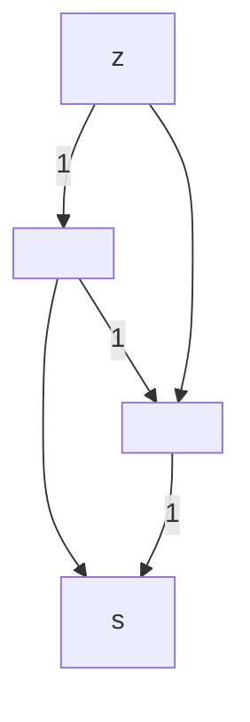

---
tags:
  - graph
  - algo
  - vyhledavani
date: 2023-10-19
completed: true
---
## Síť

Skládá se z
- **orientovaný graf** $(V,E)$
	- BÚNO symetrický
- **zdroj** $z \in V$
- **spotřebič** $s \in V, s \ne z$
- **kapacity** $c : E \rightarrow \mathbb{R}_0^{+}$

## Tok

Funkce $f : E \rightarrow \mathbb{R}_0^{+}$ 

- $\forall e \in E : f(e) \le c(e)$
- Kirchhoffův zákon $\forall v \in V, v \ne z,s : f^{\Delta}(v) = 0$

## Vrchol

- přítok
	- $f^{+} := \sum_{u,v \in E}f(uv)$
- odtok
	- $f^{-} := \sum_{u,v \in E}f(uv)$
- přebytek
	- $f^{\Delta}(v) := f^{+}(v) - f^{-}(v)$

> [!info] Pozorování $f^{\Delta}(s) = -f^{\Delta}(z)$ 
> $0 = \sum_{v \in V}f^{\Delta}(v) = f^{\Delta}(z) + f^{\Delta}(s)$
## Velikost toku

$|f| := f^{\Delta}(s)$

$f(e) \lt c(e)$

$\epsilon := \min_{e \in P}(c(e) - f(e))$
$f'(e) := \begin{cases}f(e) + \epsilon & e \in P \\ f(e) \end{cases}$

## Fordův-Fulkersonův algoritmus

- $f \leftarrow$ všude nulový tok
- Dokud $\exists P$ nenasycená cesta
	- $\epsilon \leftarrow \min_{e \in P}r(e)$
	- Pro všechny $uv \in P$
		- $\delta \leftarrow \min( \epsilon, f(uv))$
		- $f(vu) \leftarrow f(vu) - \delta$
		- $f(uv) \leftarrow f(uv) + \epsilon - \delta$
### Rezerva hrany $uv \in E$

$r(uv) := (c(uv) - f(uv)) + f(vu)$

### $e \in E$ je nenasycená $\equiv r(e) = 0$

Cesta $P$ je $\dots \equiv \forall e \in P: r(e) \gt 0$

### Konečnost

Pro:
- $c \in \mathbb{N}$ ano (zachovává celočíselnost)
- $c \in \mathbb{Q}$ ano (díky invarianci změně měřítka)
- $c \in \mathbb{R}$ jak kdy

## Řez

![[res/rez.png]]

Pro $A,B \subseteq V$:
- $E(A,B) := E \cap (A \times B)$

Řez je $E(A,B)$ pro $A \subseteq V, B = V \setminus A$ t.ž. $z \in A, s \in B$

- $f(A,B) := \sum_{e \in E(A,B)}f(e)$
- $f^{\Delta}(A,B) := f(A,B) - f(B,A)$

> [!info] Pozorování  Je-li tok a $E(A,B)$ řez
> $f^{\Delta}(A,B) = |f|$ a $|f| \le c(A,B)$
>
> $\sum_{v \in B}f^{\Delta}(v) = f^{\Delta}(s) = |f|$
> $\sum_{v \in B}f^{\Delta}(v) = f^{\Delta}(A,B)$
>
> $|f| \le c(A,B) \Rightarrow$ pokud $|f| = c(A,B)$, pak $f$ je max. tok a $E(A,B)$ je min. řez

### Lemma 

Pokud se F-F alg. zastaví, pak $f$ je max. tok.

#### Důkaz

$A := \{ v \in V | \exists \text{nenasycená cesta ze z do v}\}$

![[res/rez.png]]

## Shrnutí

1. F-F algo pro $c \in \mathbb{Q}$ skončí a najde max. tok a min. řez
2. $\forall f$ max. tok $\exists E(A,B)$ t.ž. $|f| =  c(A,B)$
3. v síti s celočíselnými kapacitami je alespoň 1 max. tok. celočíselný a F-F algo. ho najde.

## Největší párování v bipartit. grafu

- párování $F \subseteq E$ t.ž. $\forall e,f\in F : e \cap f = \emptyset$

![[res/parovani.png]]

## Složitost F-F algo pro $c = 1$

1. průchod trvá $O(n)$
2. průchod zvětší $|f|$ alespoň o 1
3. $\#$ průchodů $\le n$